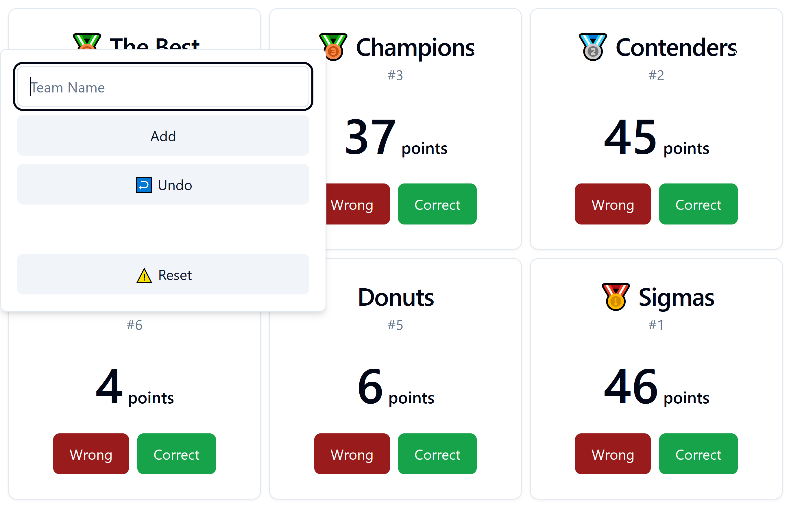

# Scoreboard

This scoreboard is intended for quiz games.

Put it on a big screen and zoom up your browser as much as possible.

If a team / player answers a question **correct**, they get **10 points**.

If their answer is **wrong** all the others get **1 point**.

## Features

- Add and remove teams / players (check the hidden button in the top left corner)
- Undo actions (using <kbd>CTRL</kbd>+<kbd>z</kbd>)
- Current rank is shown
- Adjusts to max screen width
- Reset everything
- Current state is stored in the local storage of your browser
